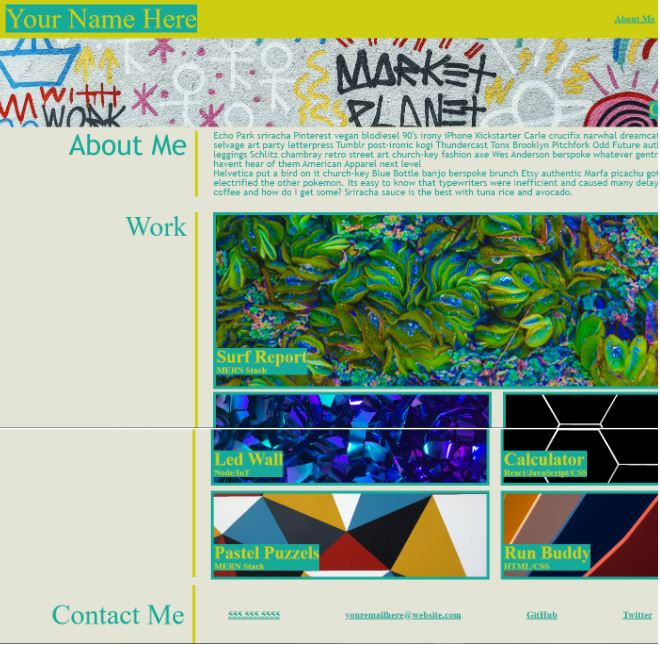

# coding-portfolio-template

## Description

- Webpage developed as a sample coding portfolio template. Reason for build was to practice html/css. Specifically to output a potential dev's name, recent photo or avatar, links to sections about them, their work, and how to contact them.
- More specifically, practiced the ability to add clickable navigation links in the nav section, add different size images positioned with flex box and responsive to all devices acting as links to different portfolio projects.
- The main purpose of the project was to sharpen html/css skills.
- The key takeaways during development was the use of the css flexbox feature and containers.

## Installation

No additional installation/resources are required to deploy the webpage

## Usage

- Click link to view repo: [Github Repo](https://github.com/Git-Vdim-Hub/coding-portfolio-templatev)
- Click link to view deployed webpage: [Github Pages](https://git-vdim-hub.github.io/coding-portfolio-template/)

- Desktop Screenshot
    
- Mobile Screenshot
    
    
    
    

## Credits

images from unsplash.com